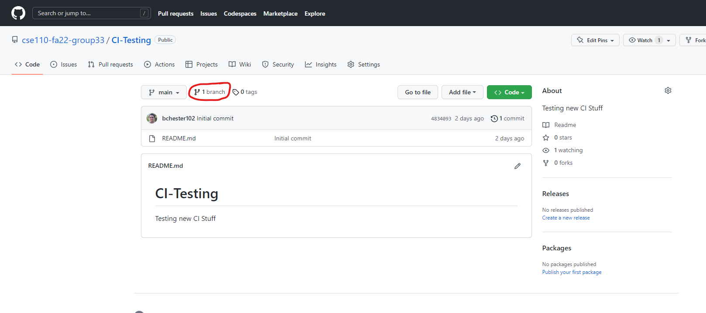
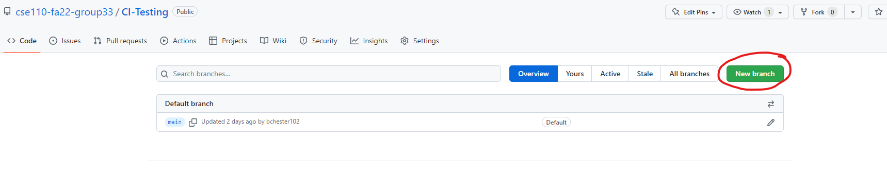
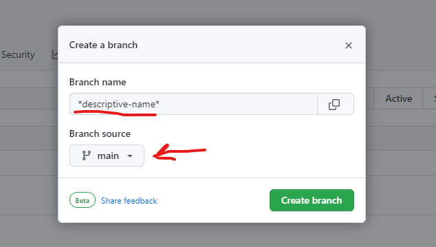
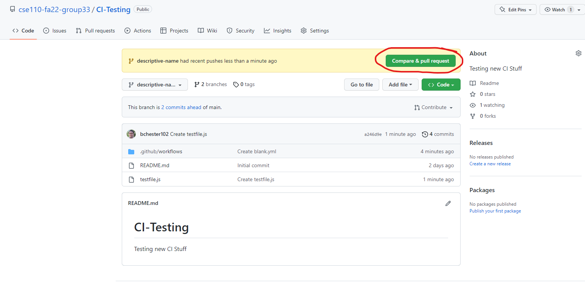
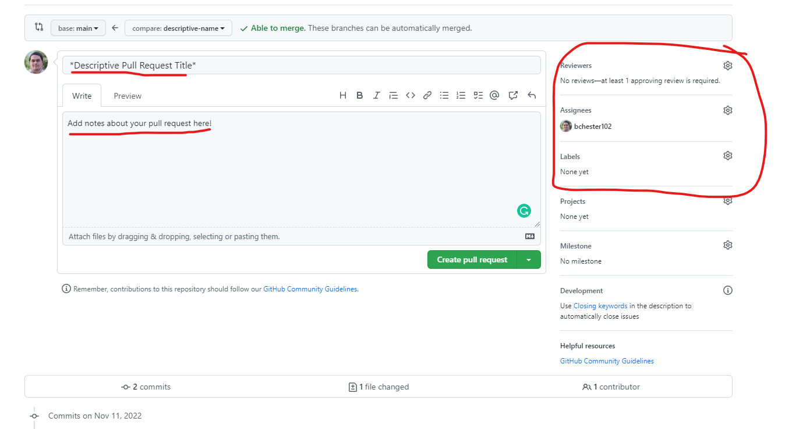
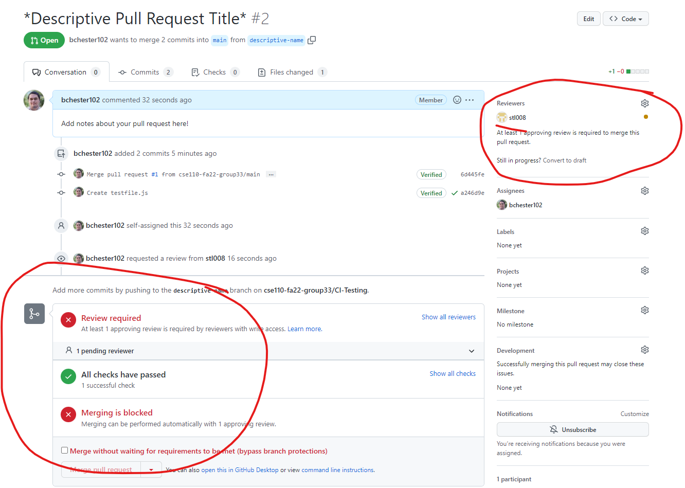
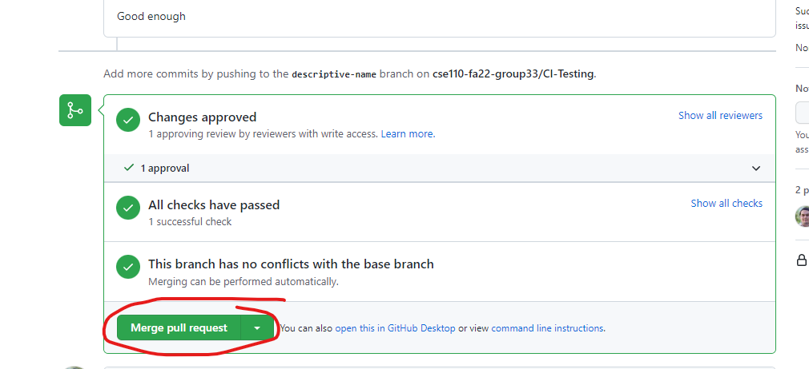
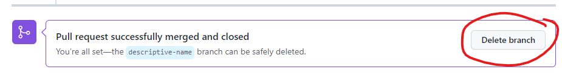

# DevOp Tutorial

## Steps:

1. When you want to work on a new feature, create a new branch off of `main` with a descriptive title.

2. Work on this branch until you believe the feature is ready or you would like feedback from others.
   - Please use descriptive commit messages and try your best to commit often.
3. Once your code is ready for review, create a pull request merging your branch with `main`.

4. To get your code merged, it should pass all the status checks, as well as get approved by two people outside of whoever is working on the branch
