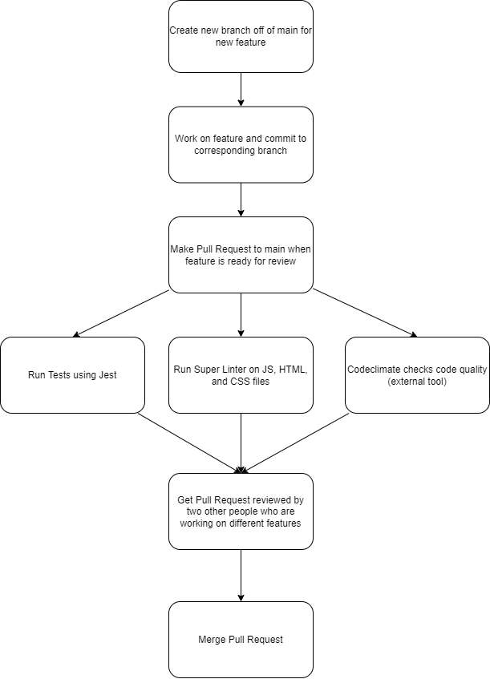

# Phase 1 Notes

Currently we require our devs to make a separate feature branch for whatever they're currently working on. This ensures that there are no conflicts when committing during development.

We looked into the subsequent suggested features for our pipeline, and here is what we ended up with:

- linting and code style enforcement (may happen in pipeline and/or in editor)
- code quality via tool  (ex. Codeclimate, Codacy, etc.)
- code quality via human review (ex. Pull Requests)
- unit tests via automation (ex. Jest, Tape, Ava, Cypress, Mocha/Chai, etc.)*
- documentation generation via automation (ex. JSDocs)

## Pipeline so far:
1. Tests are run automatically with Jest
2. The github super linter is run on our code to check for any mistakes
3. The repo is connected to the Codeclimate quality checker which checks for the code's maintainability and test coverage
4. After these automatic phase are run, the pipeline requires two human reviews and approvals for the code to be pushed to main, ideally by people who did not work on the feature that is being reviewed

The above pipeline is run when the devs make a pull request to merge their code to `main`. The pipeline is run again when pushes are made just in case they need to update their feature.

In regards to document generation, we feel that we can rely on the built in VSCode documentation generation because we feel that generating a static site for our documentation would be overkill due to the small scale of our project. If we do end up having to generate documentation, our group will be using proper JSDocs comments to it'll be easy to implement into our pipeline.

